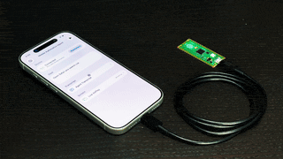

Mobile Automation
=================

An experimental project to run agent automation on iOS devices.

<div align="center">
  <a href="https://www.youtube.com/watch?v=4PN9FoEkbC4">
    
  </a>
  <p>
    The agent automatically opens Safari and searches for "cat".<br>
    Tap to open the original YouTube video.
  </p>
</div>


Overview
--------

A set of applications, libraries, and firmware to control iOS devices.

It uses a composite USB MIDI and HID device implemented in the Raspberry Pi
Pico (RP2040) firmware. The application communicates with the firmware via
MIDI messages to read screen items and control the iOS device.

By using standard MIDI and HID protocols, the application can control iOS
devices without any additional permissions.


Structure
---------

- `Firmware`

  A firmware for Raspberry Pi Pico (RP2040) that implements USB MIDI
  and HID composite device. See `Firmware/README.md` for details.

- `Applications/MobileAutomationClient`

  An iOS app to manually drive a connected device: a command palette,
  D-pad, key buttons, and a live log.

- `Applications/MobileAutomationAgent`

  An iOS app that drives a connected device autonomously toward a goal,
  using AirPlay screen mirroring for vision and an LLM (Anthropic, OpenAI,
  or the on-device Foundation Model) to decide actions.


Build
-----

### Firmware

The firmware targets RP2040 boards and is built with the Pico SDK and CMake.
Set the environment variables for the SDK and ARM toolchain, then build:

```bash
export PICO_SDK_PATH="/path/to/raspberrypi/pico-sdk"
export PATH="/path/to/arm-gnu-toolchain/bin:$PATH"

cd Firmware
make build

# Put the board in BOOTSEL mode, then flash firmware.uf2 to it.
make write
```

The default board is the Raspberry Pi Pico. For the Waveshare RP2040-One,
pass `BOARD=waveshare_rp2040_one`. See `Firmware/README.md` for board
selection and the per-role build flags.

### Client CLI

The `mobile-automation` CLI is a Swift Package executable. Build and run it
with the Swift toolchain (Swift 6.3 / macOS 26 or later):

```bash
cd Packages/MobileAutomationSupport

# Build only.
swift build

# Build and run (passes arguments to the CLI).
swift run mobile-automation --help
```

### MobileAutomationClient and MobileAutomationAgent

Both iOS apps use [XcodeGen](https://github.com/yonaskolb/XcodeGen) to generate
their Xcode projects from `project.yml`. Generate the projects first (from
the repository root):

```bash
make xcodegen
```

By default both apps build with `CODE_SIGN_STYLE = Automatic`. To override
code signing locally (for example, to use manual signing), create
`CodeSigning-Local.xcconfig` in the app's `Configurations` directory.

```
CODE_SIGN_STYLE = Manual
DEVELOPMENT_TEAM = ...
PROVISIONING_PROFILE_SPECIFIER = ...
```

Then open and build either app in Xcode (Xcode 26 or later, iOS 26
deployment target):

```bash
open Applications/MobileAutomationClient/MobileAutomationClient.xcodeproj
open Applications/MobileAutomationAgent/MobileAutomationAgent.xcodeproj
```

Or build from the command line, for example:

```bash
xcodebuild \
    -project Applications/MobileAutomationClient/MobileAutomationClient.xcodeproj \
    -scheme MobileAutomationClient \
    -destination 'generic/platform=iOS' \
    build
```


Usage
-----

Connect the Pico controller to the iOS device you want to control over USB. The board
presents itself as a composite USB MIDI + HID device: the host sends
commands as MIDI messages, and the board injects them back as HID keyboard,
mouse, and Braille events. Reading the screen relies on VoiceOver streaming
Braille display updates back over MIDI.

### Accessibility setup

Some HID roles require an iOS accessibility feature to be enabled on the
device you are controlling:

- **VoiceOver** — required for Braille keyboard usage. Enable it under
  **Settings → Accessibility → VoiceOver**. iOS recognizes the Pico controller as a
  Braille display (VoiceOver → Braille), which both accepts Braille input
  and streams the screen-state updates the client reads back.

- **AssistiveTouch** — required for mouse usage on iPhone. Enable it under
  **Settings → Accessibility → Touch → AssistiveTouch** so the HID mouse
  drives an on-screen pointer.

Enable VoiceOver and/or AssistiveTouch depending on which roles you intend
to use.

### Client CLI

Run the CLI with a subcommand. On launch it locates the first CoreMIDI
destination whose name contains `pico` and prints it to standard error.

```bash
cd Packages/MobileAutomationSupport

# Type ASCII text.
swift run mobile-automation type "hello world"

# Press a HID Usage ID (0x28 = Enter).
swift run mobile-automation key 28

# Move and click the absolute mouse.
swift run mobile-automation absolute-mouse 16384 16384
swift run mobile-automation absolute-click left

# Stream Braille screen-state updates (Ctrl-C to stop).
swift run mobile-automation braille

# List all subcommands.
swift run mobile-automation --help
```

Available subcommands include `type`, `key`, `press`, `release`, `modifier`,
`mouse`, `scroll`, `click`, `absolute-mouse`, `absolute-scroll`,
`absolute-click`, `led`, `braille`, `braille-chord`, and `braille-routing`.

### MobileAutomationClient

Run the Client app on the iOS device that is connected to the Pico controller. It
discovers the board over CoreMIDI and gives you manual control:

1. Connect to the device from the command palette.
2. Drive the device with the D-pad, key buttons, and command editors
   (type text, tap keys, move/scroll the mouse, send Braille chords and
   routing keys, set the LED).
3. Watch the live log to confirm each action.

### MobileAutomationAgent

The Agent app drives the device autonomously toward a goal you describe.

1. Enable **AssistiveTouch** on the iPhone under **Settings → Accessibility
   → Touch → AssistiveTouch** so the agent's mouse actions drive an
   on-screen pointer.
2. Open **Settings** and provide an API key for your chosen model provider
   (Anthropic or OpenAI), or select the on-device Foundation Model.
3. Connect to the Pico controller from the **Device** section.
4. Start **Screen Mirroring** from Control Center and pick the Agent's
   AirPlay receiver so the agent can see the screen.
5. Enter a goal (e.g. "Open Settings and toggle Wi-Fi.") and tap **Run**.
6. Follow progress in the transcript; tap **Stop** to end the run.


License
-------

This project itself is provided under the [MIT license](LICENSE).

The MobileAutomationAgent app depends on
[AirPlayScreenshot](https://github.com/niw/AirPlayScreenshot), which in turn
depends on [UxPlay](https://github.com/FDH2/UxPlay) through
[UxPlaySwift](https://github.com/niw/UxPlaySwift), which is licensed under the
GPL-3.0.

Any project that includes AirPlayScreenshot is considered a derivative work of
UxPlay and is, therefore, subject to the terms of the GPL-3.0.
In practice this means the MobileAutomationAgent app, as a whole, must comply
with the GPL-3.0 license rules.

The Firmware, the `mobile-automation` client CLI, and the MobileAutomationClient
app do not depend on AirPlayScreenshot and are not affected.
